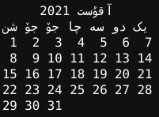
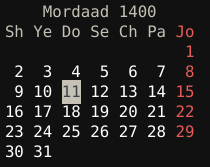
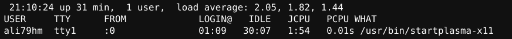
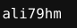
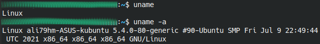
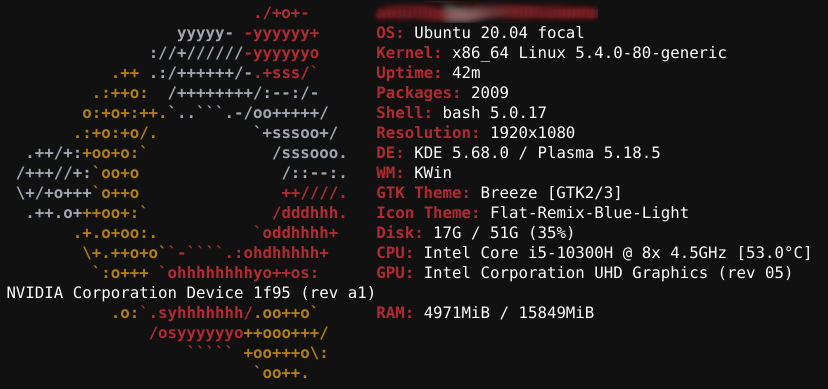
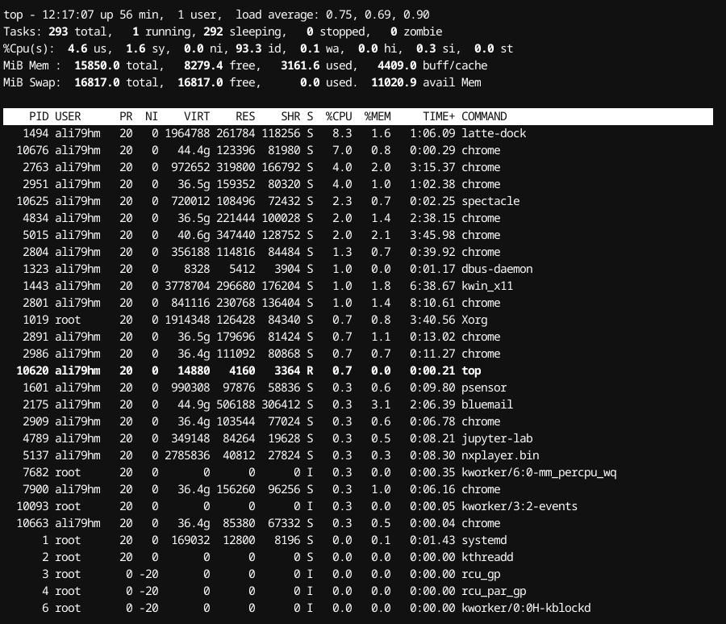
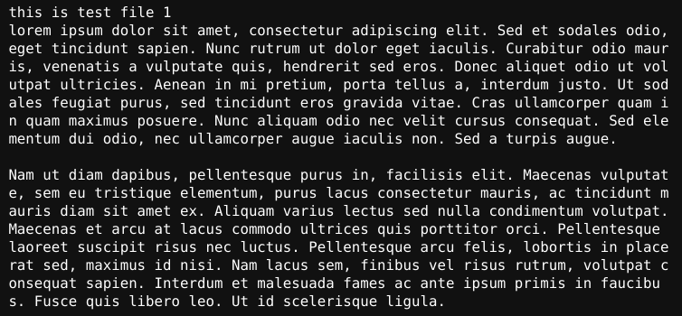

linux basic commands
---
by: seyed ali hosseini

---

# information commands

## date
for print today date use ```date``` command


## show calender

for showing calender use ```cal``` command



you can install persian calender by ```sudo apt install jcal```

```shell 
jcal
```


## uptime
```shell
uptime
```


other command like ```uptime``` is ``` w ```  but shows more detail

```shell
 w
```




## find username

```shell
whoami
```


## get system type
```shell
uname
```
for get more information add ```-a``` to 



see more information about os 
```shell
cat /etc/os-release
```
or you can get full data with ```screenfetch```
install screenfetch : ```sudo apt install screenfetch```
```shell
screenfetch
```


## get hardware information

```shell
cat /proc/cpuinfo  #show cpu information
cat /proc/meminfo  #show ram information
lscpu              #show cpu information
lsmem              #show ram information
df                 #show disk usage 
du                 #show disk usage by every directory
free               #show memory usage
```
you can get running apps by :
```shell
top
```


# work with files and directories

## see files in this directory
```shell
ls
```
for more detail add ```-l``` to end of it

## see current directory
```shell
pwd
```

## change directory
```shell
cd dir
```

## create directory
```shell
mkdir dirname
```

## make file 
```shell
touch file
```

## remove file and directories
```shell
rm filename    #remove file
rm -f filename #force remove file
rm -r dir      #remove directory
```

## rename or move file
```shell
mv file dir     #move to other dir
mv file1 file2  #change name
```

## copy file
```shell
cp file1 file2   #copy file
cp -r dir1 dir2  #copy directory
```

## openning text files
```shell
cat filename
```



there are betere way instead of using ```cat```
```shell
more file #like cat command but shows long files
# press enter for scroll down | press q for exit
less file #like cat command but shows long files
# press q for exit | use arrow keys for scroll 

cat file |less #usefull for commands with huge data return 

head file # show file first 10 lines
head -20 file # show file first 20 lines

tail file # show file last 10 lines
tail -20 file # show file last 20 lines
```

## create shortcut
```shell
ln -s filename link #create shortcut
```

# work with tar
